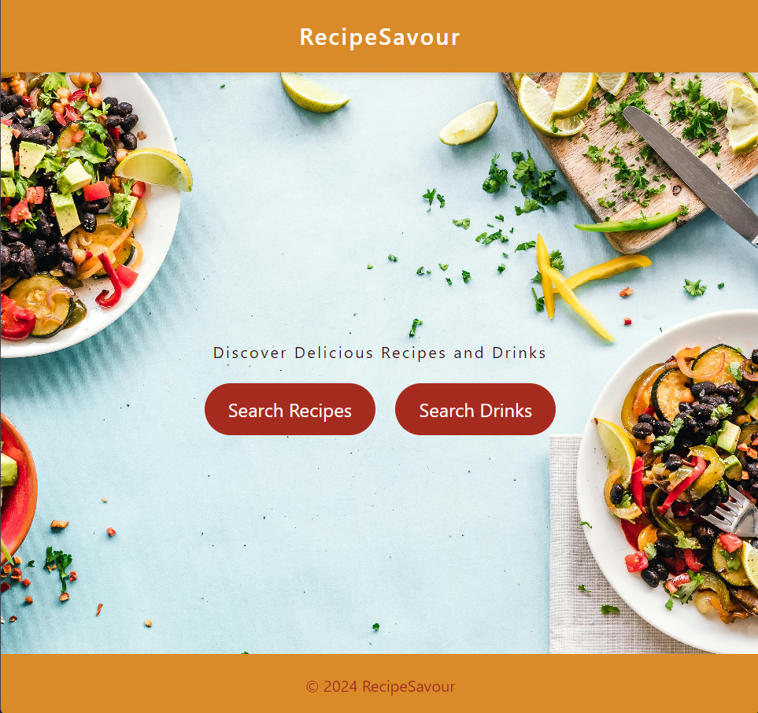
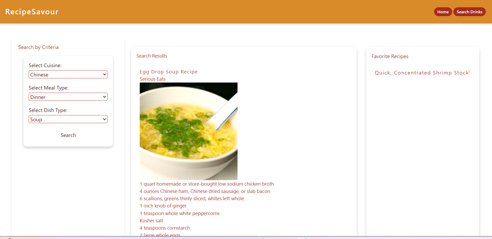
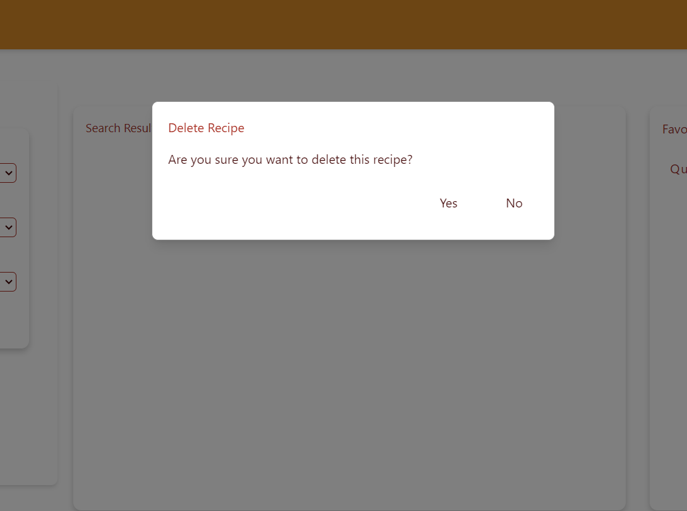
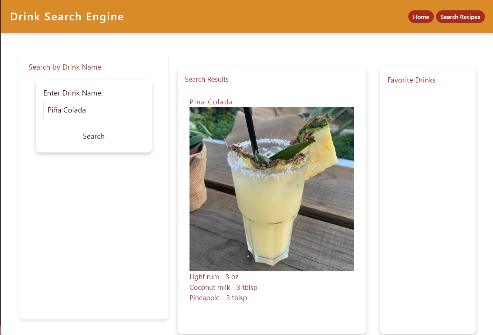

## Project Group 5

## Group members: Chris Reynolds, Brad Bevan, Tinaika Pereira, Chris Concepcion
 

# Project Name
RecipeSavour

## Description

This project is a real-world front-end application developed as a group assignment, utilizing skills acquired over the past six modules. The application allows users to interact with the website to search and manage their favorite recipes. It includes functionalities such as adding and editing with data persistence using client-side storage. The project meets the requirements of having a responsive, polished UI and is deployed to GitHub Pages.

## Technologies Used

- **CSS Framework:** Tailwind CSS  
- **Server-side APIs:** Edamam, The cocktail DB   
- **Client-side Storage:** LocalStorage   
- **Version Control:** Git and GitHub   
- **Deployment:** GitHub Pages

## Features

- **Interactive Interface**: Users can add, edit, and delete their favorite recipes. 
- **Modal**: Custom modals are used for user interactions.  
- **Client-side Storage**: Uses localStorage for persistent data, ensuring user data is retained across sessions. 
- **Responsive Design**: The application is fully responsive and optimized for mobile and tablet devices.  
- **Polished UI**: A well-designed and user-friendly interface.  

## Usage

1. **Adding Recipes**: Users can add new recipes by clicking the 'Add Recipe' button and filling in the details in the modal form.  
2. **Editing Recipes**: Users can edit existing recipes by selecting the 'Edit' option on a recipe card. 
3. **Add to favorite Recipes**: Users can add their favorite recipes to the favorite sidebar.  
4. **Deleting Recipes**: Users can delete their  recipes from the favorite sidebar.  

## Screenshots 

## Licence 

Please refer to the licence in the repo 
